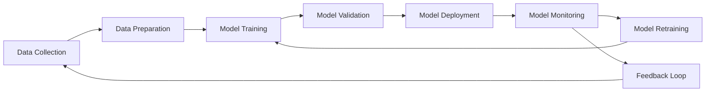

# MLOps - Machine Learning Operations

## Table of Contents

- [What is MLOps?](#what-is-mlops)
- [Why MLOps Matters](#why-mlops-matters)
- [Key Components of MLOps](#key-components-of-mlops)
- [MLOps Lifecycle](#mlops-lifecycle)
- [MLOps vs DevOps](#mlops-vs-devops)
- [Popular MLOps Tools and Platforms](#popular-mlops-tools-and-platforms)
- [Best Practices](#best-practices)
- [Getting Started with MLOps](#getting-started-with-mlops)
- [Common Challenges](#common-challenges)
- [Resources and Further Reading](#resources-and-further-reading)

## What is MLOps?

**MLOps** (Machine Learning Operations) is a set of practices that aims to deploy and maintain machine learning models in production reliably and efficiently. It combines Machine Learning, DevOps, and Data Engineering to create a unified workflow for the entire ML lifecycle.

MLOps bridges the gap between data science experimentation and production deployment by providing:

- **Automation** of ML workflows
- **Reproducibility** of experiments and models
- **Scalability** for production workloads
- **Monitoring** and governance of ML systems
- **Collaboration** between data scientists, engineers, and operations teams

## Why MLOps Matters

### Business Impact

- **Faster Time-to-Market**: Accelerate model deployment from months to days
- **Improved Model Performance**: Continuous monitoring and retraining ensure models stay accurate
- **Cost Optimization**: Efficient resource utilization and automated scaling
- **Risk Mitigation**: Better governance, compliance, and model interpretability

### Technical Benefits

- **Reproducibility**: Version control for data, code, and models
- **Scalability**: Handle increasing data volumes and user requests
- **Reliability**: Automated testing, validation, and rollback capabilities
- **Observability**: Monitor model performance, data drift, and system health

## Key Components of MLOps

### 1. **Data Management**

- Data versioning and lineage tracking
- Data validation and quality checks
- Feature stores for reusable features
- Data pipeline orchestration

### 2. **Model Development**

- Experiment tracking and comparison
- Hyperparameter tuning and optimization
- Model versioning and registry
- Automated model testing and validation

### 3. **Model Deployment**

- Containerization (Docker, Kubernetes)
- CI/CD pipelines for ML models
- A/B testing and canary deployments
- Multi-environment deployment (dev, staging, prod)

### 4. **Monitoring and Governance**

- Model performance monitoring
- Data drift detection
- Model bias and fairness assessment
- Compliance and audit trails

### 5. **Infrastructure and Orchestration**

- Cloud platforms (AWS, GCP, Azure)
- Container orchestration
- Workflow management
- Resource scaling and optimization

## MLOps Lifecycle



### 1. **Data Collection & Preparation**

- Gather and clean raw data
- Feature engineering and selection
- Data validation and quality assurance
- Create training, validation, and test datasets

### 2. **Model Development & Training**

- Experiment with different algorithms
- Hyperparameter tuning
- Model training and validation
- Performance evaluation and comparison

### 3. **Model Deployment**

- Package models for production
- Deploy to staging and production environments
- Set up monitoring and logging
- Implement rollback strategies

### 4. **Monitoring & Maintenance**

- Track model performance metrics
- Monitor data and concept drift
- Detect anomalies and issues
- Trigger retraining when needed

## MLOps vs DevOps

| Aspect         | DevOps                          | MLOps                                                |
| -------------- | ------------------------------- | ---------------------------------------------------- |
| **Focus**      | Software applications           | ML models and data pipelines                         |
| **Testing**    | Unit, integration, system tests | Data validation, model validation, performance tests |
| **Deployment** | Code deployment                 | Model + code + data deployment                       |
| **Monitoring** | Application metrics, logs       | Model performance, data drift, business metrics      |
| **Versioning** | Code versioning                 | Code + data + model versioning                       |
| **Rollback**   | Previous code version           | Previous model version with data considerations      |

## Popular MLOps Tools and Platforms

### **Experiment Tracking & Model Management**

- **MLflow**: Open-source ML lifecycle management
- **Weights & Biases (wandb)**: Experiment tracking and collaboration
- **Neptune**: ML metadata management
- **Kubeflow**: Kubernetes-native ML workflows

### **Feature Stores**

- **Feast**: Open-source feature store
- **Tecton**: Enterprise feature platform
- **AWS SageMaker Feature Store**
- **Google Cloud Vertex AI Feature Store**

### **Model Deployment & Serving**

- **Seldon Core**: ML deployment on Kubernetes
- **KServe**: Serverless ML inference
- **TensorFlow Serving**: TensorFlow model serving
- **MLflow Models**: Model packaging and deployment

### **Cloud Platforms**

- **AWS SageMaker**: End-to-end ML platform
- **Google Cloud Vertex AI**: Unified ML platform
- **Azure Machine Learning**: Cloud ML service
- **Databricks**: Unified analytics platform

### **Orchestration & Pipelines**

- **Apache Airflow**: Workflow orchestration
- **Kubeflow Pipelines**: ML workflow orchestration
- **Prefect**: Modern workflow orchestration
- **Argo Workflows**: Kubernetes-native workflows

## Best Practices

### 1. **Start Simple**

- Begin with basic automation before complex orchestration
- Focus on high-impact, low-effort improvements first
- Gradually introduce more sophisticated MLOps practices

### 2. **Version Everything**

- Use version control for code, data, and models
- Maintain reproducible environments
- Document dependencies and configurations

### 3. **Automate Testing**

- Implement data validation checks
- Test model performance and behavior
- Validate model outputs and predictions

### 4. **Monitor Continuously**

- Track model performance in production
- Monitor data quality and drift
- Set up alerts for anomalies and degradation

### 5. **Collaborate Effectively**

- Establish clear roles and responsibilities
- Use shared tools and platforms
- Document processes and decisions

### 6. **Security and Compliance**

- Implement proper access controls
- Ensure data privacy and protection
- Maintain audit trails and documentation

## Getting Started with MLOps

### Phase 1: Manual Process (Level 0)

- Manual model training and deployment
- Basic experiment tracking
- Simple monitoring

### Phase 2: ML Pipeline Automation (Level 1)

- Automated model training pipelines
- Continuous integration for ML code
- Automated model validation

### Phase 3: CI/CD Pipeline Automation (Level 2)

- Automated model deployment
- Comprehensive testing and validation
- Continuous monitoring and retraining

### Sample MLOps Project Structure

```
mlops-project/
├── data/
│   ├── raw/
│   ├── processed/
│   └── features/
├── models/
│   ├── experiments/
│   ├── trained/
│   └── deployed/
├── src/
│   ├── data_processing/
│   ├── training/
│   ├── inference/
│   └── monitoring/
├── tests/
│   ├── unit/
│   ├── integration/
│   └── model_validation/
├── deployment/
│   ├── docker/
│   ├── kubernetes/
│   └── terraform/
├── pipelines/
│   ├── training/
│   └── inference/
└── monitoring/
    ├── dashboards/
    └── alerts/
```

## Common Challenges

### Technical Challenges

- **Data Quality**: Inconsistent, missing, or biased data
- **Model Drift**: Performance degradation over time
- **Scalability**: Handling increasing data and traffic
- **Integration**: Connecting ML systems with existing infrastructure

### Organizational Challenges

- **Skill Gaps**: Lack of MLOps expertise
- **Cultural Resistance**: Reluctance to adopt new practices
- **Tool Proliferation**: Managing multiple tools and platforms
- **Governance**: Ensuring compliance and risk management

### Solutions

- **Education and Training**: Invest in team skill development
- **Gradual Adoption**: Implement MLOps practices incrementally
- **Tool Standardization**: Choose and standardize on key tools
- **Clear Processes**: Define workflows and responsibilities

## Resources and Further Reading

### Books

- "Building Machine Learning Pipelines" by Hannes Hapke and Catherine Nelson
- "Introducing MLOps" by Mark Treveil and the Dataiku Team
- "Machine Learning Design Patterns" by Valliappa Lakshmanan, Sara Robinson, and Michael Munn

### Online Resources

- [MLOps.org](https://mlops.org/) - Community-driven MLOps resources
- [Google Cloud MLOps Guide](https://cloud.google.com/architecture/mlops-continuous-delivery-and-automation-pipelines-in-machine-learning)
- [AWS MLOps Best Practices](https://aws.amazon.com/sagemaker/mlops/)
- [Microsoft MLOps Documentation](https://docs.microsoft.com/en-us/azure/machine-learning/concept-model-management-and-deployment)

### Certifications

- **AWS Certified Machine Learning - Specialty**
- **Google Cloud Professional Machine Learning Engineer**
- **Microsoft Azure AI Engineer Associate**

### Communities

- [MLOps Community](https://mlops.community/)
- [Reddit r/MachineLearning](https://www.reddit.com/r/MachineLearning/)
- [Stack Overflow MLOps Tag](https://stackoverflow.com/questions/tagged/mlops)

---

## Contributing

This directory is part of a DevOps learning repository. Feel free to contribute additional MLOps examples, tools, and best practices.

## License

This content is available under the MIT License. See the main repository LICENSE file for details.
