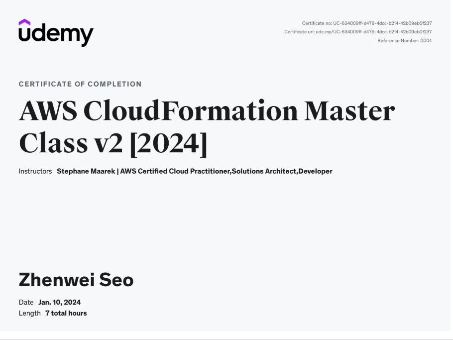

## Course Link

AWS CloudFormation Master Class v2 [2024]
https://www.udemy.com/course/aws-cloudformation-master-class

## What You'll Learn

- YAML
- Parameters
- SSM Parameter Types
- Resources
- Advanced Resources (DependsOn, DeletionPolicy, UpdateReplacePolicy, CreationPolicy, UpdatePolicy)
- Mappings
- Pseudo Parameters
- Outputs & Cross Stack References
- Conditions
- Rules
- Metadata
- CFN Init
- Drift
- Nested Stacks
- StackSets
- Deployment Options (ChangeSets, StackPolicy, Rollback, Termination, Service Roles)
- Continuous Delivery with CodePipeline
- Custom Resources (Lambda & SNS)
- WaitCondition
- Dynamic References
- Registry, 3rd-party Resource Types & Modules
- Resource Imports
- SAM (Serverless Application Model) Intro
- CDK (Cloud Development Kit) Intro
- Macros
- Template Validation
- Best Practices

## Course Cerfificate of Completion

https://www.udemy.com/certificate/UC-634009ff-d479-4dcc-b214-42b09eb0f237/

