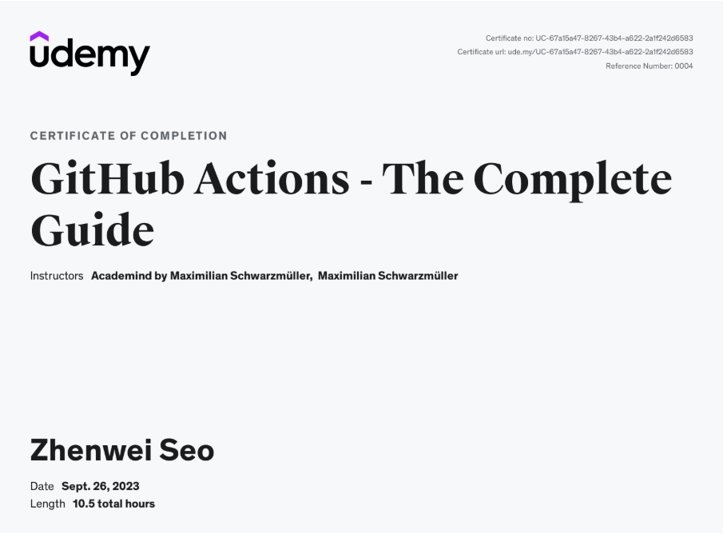

# Course Link

GitHub Actions - The Complete Guide
https://www.udemy.com/course/github-actions-the-complete-guide

## What You'll Learn

- Use GitHub Actions to build automated workflows & processes
- Automate code-based and project-based tasks
- Run simple and complex workflows on a broad variety of triggers
- Build powerful CI / CD workflows, including runtime configuration, security and conditional execution
- Build custom actions or leverage public community solutions
- How to secure GitHub Action workflows

## Course Certificate of Completion

https://www.udemy.com/certificate/UC-67a15a47-8267-43b4-a622-2a1f242d6583/

