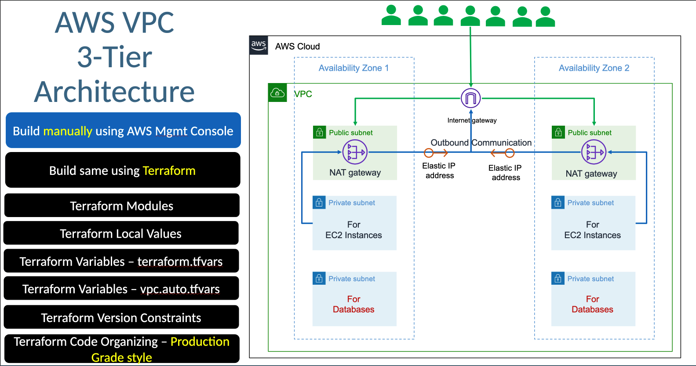
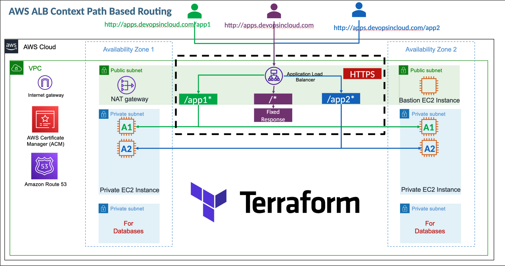
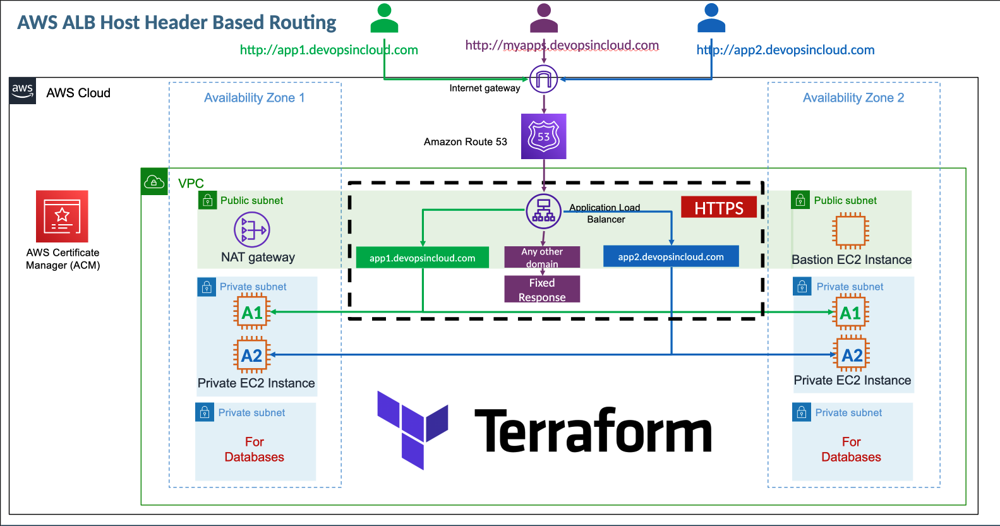
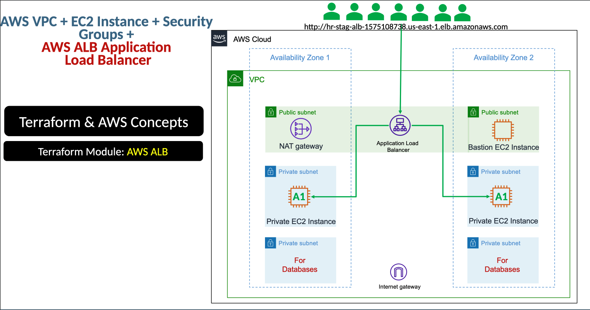
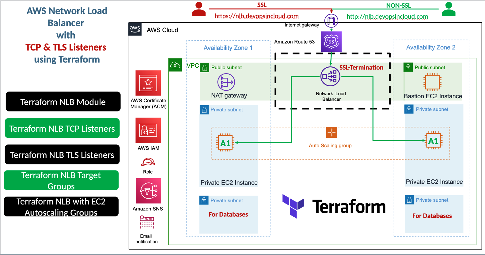
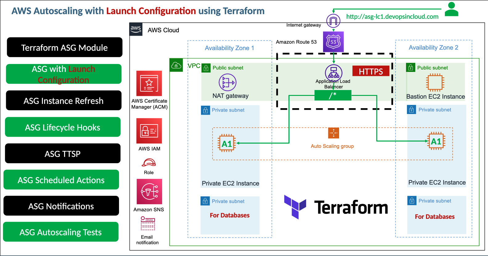
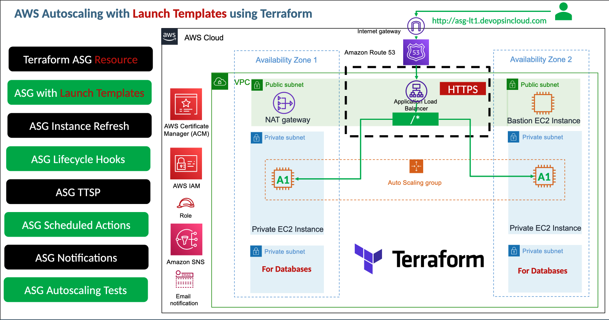
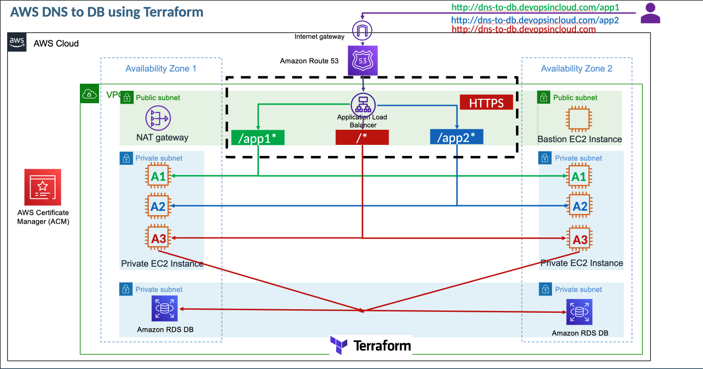
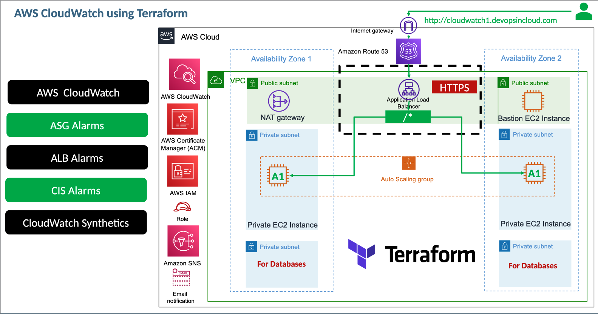
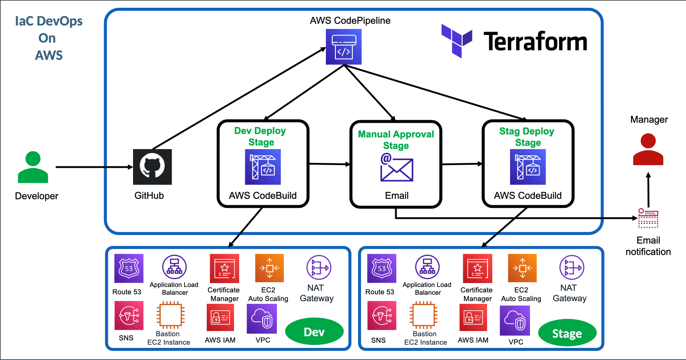

# Terraform on AWS with SRE & IaC DevOps - Demo Projects

This document provides an overview of all the demo projects and their corresponding architecture diagrams from the **Terraform on AWS with SRE & IaC DevOps | Real-World 20 Demos** course.

## 📋 Course Overview

**Course**: [Terraform on AWS with SRE & IaC DevOps | Real-World 20 Demos](https://www.udemy.com/course/terraform-on-aws-with-sre-iac-devops-real-world-demos)  
**Start Date**: November 15, 2025  
**Status**: 🟡 In-Progress

## 🏗️ Demo Projects & Architecture Diagrams

### 1. AWS VPC 3-Tier Architecture

**Architecture Overview**: Complete 3-tier architecture implementation with VPC, subnets, security groups, and networking components.



**Key Components**:

- VPC with public and private subnets
- Internet Gateway and NAT Gateway
- Security groups and NACLs
- Multi-AZ deployment for high availability

---

### 2. Application Load Balancer (ALB) Configurations

#### ALB with Context Path-Based Routing

**Architecture Overview**: Application Load Balancer configured with path-based routing to direct traffic to different target groups based on URL paths.



**Key Features**:

- Path-based routing rules
- Multiple target groups
- Health checks and monitoring

#### ALB with Host Header-Based Routing

**Architecture Overview**: Application Load Balancer configured with host header-based routing for multi-tenant applications.



**Key Features**:

- Host-based routing rules
- SSL/TLS termination
- Multi-domain support

#### ALB with VPC Integration

**Architecture Overview**: Complete VPC setup with Application Load Balancer integration.



**Key Components**:

- ALB in public subnets
- Target groups in private subnets
- Security group configurations

---

### 3. Network Load Balancer (NLB) with TCP/TLS Listeners

**Architecture Overview**: Network Load Balancer configuration with TCP and TLS listeners for high-performance traffic handling.



**Key Features**:

- Layer 4 load balancing
- TCP and TLS listener configurations
- Cross-zone load balancing
- Ultra-low latency performance

---

### 4. Auto Scaling Configurations

#### Auto Scaling with Launch Configuration

**Architecture Overview**: Auto Scaling Group implementation using Launch Configurations for EC2 instance management.



**Key Components**:

- Launch Configuration templates
- Auto Scaling Groups
- Scaling policies and CloudWatch integration
- Multi-AZ instance distribution

#### Auto Scaling with Launch Templates

**Architecture Overview**: Modern Auto Scaling Group implementation using Launch Templates with enhanced features.



**Key Enhancements**:

- Launch Template flexibility
- Mixed instance types
- Spot and On-Demand instances
- Advanced networking configurations

---

### 5. DNS to Database Architecture

**Architecture Overview**: Complete end-to-end architecture from DNS resolution to database connectivity.



**Key Components**:

- Route 53 DNS configuration
- Application Load Balancer
- EC2 instances in Auto Scaling Groups
- RDS database in private subnets
- Security group configurations for database access

---

### 6. CloudWatch Monitoring and Alarms

**Architecture Overview**: Comprehensive monitoring setup with CloudWatch metrics, alarms, and notifications.



**Key Features**:

- Custom CloudWatch metrics
- CloudWatch alarms and thresholds
- SNS notifications
- Auto Scaling integration with alarms
- Dashboard and visualization

---

### 7. IaC DevOps Pipeline

**Architecture Overview**: Infrastructure as Code DevOps pipeline using AWS CodePipeline for Terraform deployments.



**Key Components**:

- AWS CodeCommit for source control
- AWS CodeBuild for Terraform execution
- AWS CodePipeline for orchestration
- S3 backend for Terraform state
- IAM roles and permissions for automation

---

## 📚 Learning Objectives Covered

### Core Terraform Skills

- [x] Infrastructure as Code fundamentals
- [x] Terraform configuration syntax
- [x] Resource management and dependencies
- [x] State management (local and remote)
- [x] Terraform modules (public and local)
- [x] Terraform provisioners

### AWS Infrastructure Components

- [x] VPC and networking fundamentals
- [x] Load balancer configurations (ALB, NLB, CLB)
- [x] Auto Scaling Groups and Launch Templates
- [x] Security groups and network ACLs
- [x] Route 53 DNS management
- [x] RDS database configurations

### DevOps and SRE Practices

- [x] Infrastructure as Code best practices
- [x] CI/CD pipeline implementation
- [x] Monitoring and alerting setup
- [x] High availability architecture design
- [x] Security and compliance considerations

---

## 🎯 Demo Progress Tracking

| Demo # | Topic                        | Status     | Completion Date |
| ------ | ---------------------------- | ---------- | --------------- |
| 1      | VPC 3-Tier Architecture      | 📋 Planned | -               |
| 2      | ALB Context Path Routing     | 📋 Planned | -               |
| 3      | ALB Host Header Routing      | 📋 Planned | -               |
| 4      | NLB TCP/TLS Listeners        | 📋 Planned | -               |
| 5      | Auto Scaling Launch Config   | 📋 Planned | -               |
| 6      | Auto Scaling Launch Template | 📋 Planned | -               |
| 7      | DNS to DB Architecture       | 📋 Planned | -               |
| 8      | CloudWatch Monitoring        | 📋 Planned | -               |
| 9      | IaC DevOps Pipeline          | 📋 Planned | -               |
| 10-22  | Additional Demos             | 📋 Planned | -               |

---

## 📁 Project Structure

```
Terraform on AWS with SRE & OaC DevOps/
├── Demo-Projects.md                              # This overview document
├── AWS-VPC-3-Tier-Architecture.png             # VPC architecture diagram
├── ALB-Context-Path-Based-Routing.png          # ALB path routing architecture
├── ALB-Host-Header-Based-Routing.png           # ALB host routing architecture
├── AWS-VPC-ALB.png                             # VPC with ALB integration
├── AWS-NLB-with-TCP-TLS-Listeners.png          # NLB architecture
├── AWS-Autoscaling-with-Launch-Configuration.png # Auto Scaling with Launch Config
├── AWS-Autoscaling-with-Launch-Templates.png    # Auto Scaling with Launch Template
├── AWS-DNS-to-DB.png                           # DNS to Database architecture
├── AWS-Cloudwatch.png                          # CloudWatch monitoring setup
├── AWS-IaC-DevOps.png                          # IaC DevOps pipeline
└── [Demo folders and Terraform configurations] # To be added as course progresses
```

---

## 🔗 Related Resources

- **Course Link**: [Terraform on AWS with SRE & IaC DevOps](https://www.udemy.com/course/terraform-on-aws-with-sre-iac-devops-real-world-demos)
- **Prerequisites**: AWS fundamentals, basic Terraform knowledge
- **Main Learning Path**: [DevOps Learning Journey](../../../README.md)
- **Previous Course**: [Kubernetes Hands-On](../Kubernetes%20Hands-On%20-%20Deploy%20Microservices%20to%20the%20AWS%20Cloud/)

---

**Last Updated**: November 15, 2025  
**Course Progress**: Starting Phase - Architecture Overview Complete
