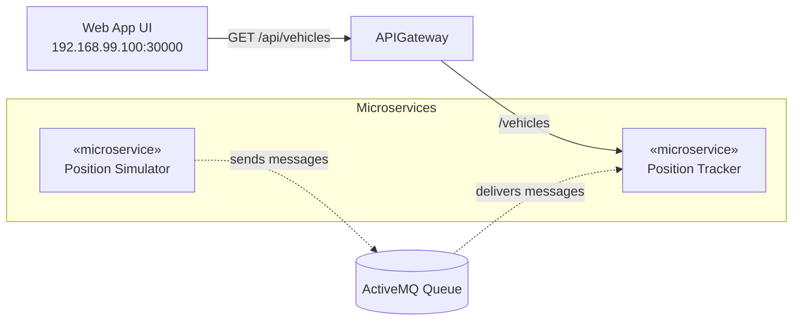

```mermaid
flowchart LR
    WebApp[Web App UI<br/>192.168.99.100:30000] -->|GET /api/vehicles| APIGateway

    subgraph Microservices
        PositionSimulator[«microservice»<br/>Position Simulator]
        PositionTracker[«microservice»<br/>Position Tracker]
    end

    APIGateway -->|/vehicles| PositionTracker

    PositionSimulator -.->|sends messages| ActiveMQ[(ActiveMQ Queue)]
    ActiveMQ -.->|delivers messages| PositionTracker
```
