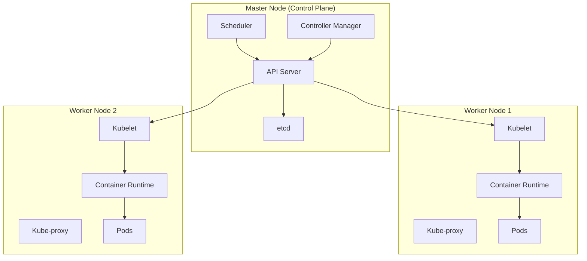

# Kubernetes Architecture Overview

Kubernetes is a powerful open-source platform designed to automate the deployment, scaling, and management of containerized applications. Understanding its architecture is crucial for effectively utilizing its capabilities. Below is an overview of the key components that make up the Kubernetes architecture.

## Master Node Components

The Master Node is the control plane of the Kubernetes cluster, responsible for managing the cluster's state
and orchestrating the worker nodes.

- **API Server**: The API server is the front-end of the Kubernetes control plane. It exposes the Kubernetes API and serves as the main entry point for all administrative tasks.
- **Controller Manager**: The Controller Manager is responsible for running various controllers that regulate the state
- **Scheduler**: The Scheduler is responsible for assigning newly created pods to worker nodes based on
  resource availability and other constraints.
- **etcd**: etcd is a distributed key-value store that Kubernetes uses to store
  all cluster data, including configuration data, state information, and metadata.
  of the cluster, such as the Node Controller, Replication Controller, and Endpoint Controller.

## Worker Node Components

Worker Nodes are the machines where the actual application workloads run. Each worker node contains several key components:

- **Kubelet**: The Kubelet is an agent that runs on each worker node. It ensures that containers are running in a pod as specified by the PodSpec.
- **Kube-proxy**: Kube-proxy is a network proxy that runs on
  each worker node. It maintains network rules and facilitates communication between pods and services.
- **Container Runtime**: The Container Runtime is the software responsible for running containers. Kubernetes supports various container runtimes, such as Docker, containerd, and CRI-O.

## Main Kubernetes Components

- **Pod**: The smallest deployable unit in Kubernetes that contains one or more containers sharing storage and network.
- **Service**: An abstraction that defines a logical set of pods and enables network access to them.
- **Ingress**: Manages external HTTP/HTTPS access to services within the cluster, providing load balancing and SSL termination.
- **ConfigMap**: Stores non-confidential configuration data in key-value pairs for use by pods and applications.
- **Secret**: Stores sensitive information like passwords, tokens, and keys in an encrypted format.
- **Deployment**: Manages the deployment and scaling of stateless applications with rolling updates and rollback capabilities.
- **StatefulSet**: Manages stateful applications that require persistent storage and stable network identities.
- **DaemonSet**: Ensures that a copy of a pod runs on all or selected nodes in the cluster.
